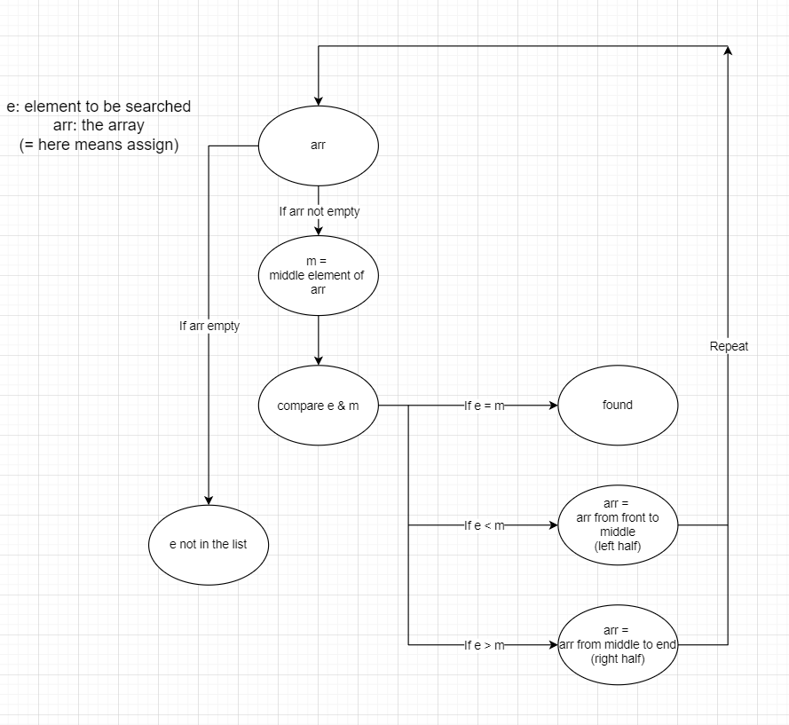

# Binary Search Algorithm
Binary Search is a searching algorithm that aims to find the desired element in an already sorted list.

---
## How it works

We first find out the middle element ($m$) in the list, and compare it with the desired element ($e$). If $e=m$, $m$ is the element we search for. If $e<m$, we repeated aforementioned step with the left half of list starting from front to $m$. If $e>m$, we repeated aforementioned step with the right half of list starting from $m$ to the end. This step is repeated until the $e$ is found, or no further steps can be done and we assert $e$ is not in the list.

Here is the diagram to show the steps.

---
## Why it corrects

Since the list is sorted beforehand, if the element is present in the array, it position is fixed based on its relative value. Hence, by comparasion, we can always approach the element until found or no further element can be checked.

---
## Time analysis

In its best case, the element searched is in the middle of the array. Hence 1 operation and it is found. In this case the algorithm is $O(1)$

In its worse case, element is not in the array, and we need to repeat the steps until no further subarray can be searched. In this case, each step restricts possible space of element to half. Hence $log_2(n)$ steps need be done, and that is $O(log(n))$

In its average case, the element is in the random place of array. In this case, we expect to go over half of the process to find the element, so $\cfrac{log_2(n)}{2}$ operations are needed, and that is $O(log(n))$

---
[back to main page](https://excalibur021.github.io/CAT125R/)