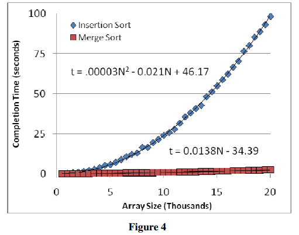

# Critique
[Merge Sort](https://cs.fit.edu/~pkc/classes/writing/hw13/luis.pdf)

This paper introduce the merge sort algorithm. It starts with brief introduction with other sorting algorithms. Then it introduce the divide & conquer procedure of merge sort with psuedocode and graphs clearly step by step. After this, a whole chapter is used to completely calculate and evaluate time efiiciency in different cases. Then it conduct an experiment using computer in order to check the time efficiency calculated before.

The graphs are very helpful for readers to understand what merge sort algorithm is doing. Also, if readers are interested in rigid mathematics proof and induction, they can read the entire chapter 4. It provides step by step calculation of recursion procedures and find out the answer. What other similar articls don't have but included in this one is the real computer running experiment. This let readers clearly see what is the exact time used for the algorithm as array size changed. Graphs of the result can show the comparason between good time efficiency of merge sort and awful performance of selection sort. Readers can also use these raw data to check for other results or get their own conclusions.

This article can improves in following ways. Other than time efficiency, space efficiency can also be calculated, as it is important to merge sort but it's different than others. Also, more other algorithm can be included in the experiment for comparason. Moreover, for the convinience of repeat experiement, raw code for emperical experiment is better to include in the article.

The result figure is included below for quick reference

---
[back to main page](https://excalibur021.github.io/CAT125R/)