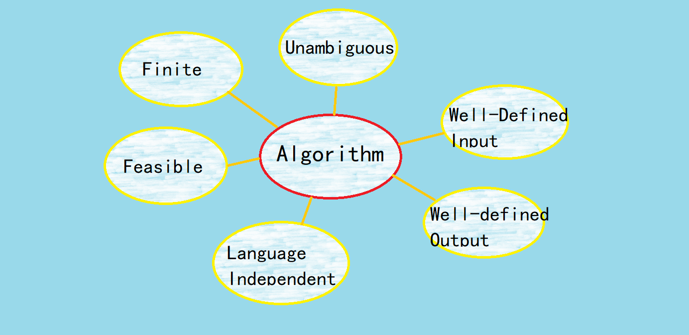

# Defination & Basic Properties of Algorithm

## Defination

---
In mathematics and computer science, an algorithm is a finite sequence of well-defined instructions, typically used to solve a class of specific problems or to perform a computation.

## Basic Properties

---
Here are some basic properties of an algorithm to make it works:

* **Unambiguous**: each step of operation need to be clear
* **Well-defined input**: it should point out what kind of input it receives
* **Well-defined output**: it should clearly define what it returns
* **Finite**: number of steps need to be finite, i.e. there should be no infinite loop
* **Feasible**: the operations in algorithm has to be runnable, things impossible to run cannot be included
* **Language independent**: the algorithm has nothing to do with a specific language, it should be able to implemented with different programming languages

---
[back to main page](https://excalibur021.github.io/CAT125R/)